# ThreadStock AI Agent Operating Manual

> **Canonical Operating Document for AI Coding Agents**  
> **Repository:** `ThreadStock` (`d:\Threadstock5.0`)  
> **Version:** 2.0 (Living Document)  
> **Reference Date:** September 2026  
> **Status:** Active & Mandatory for all AI coding agents

---

## 1. Product Overview & Purpose

**ThreadStock** is an AI-powered fashion inventory, retail, purchasing, sales, supply-chain, reporting, and commerce operating system.

It is engineered specifically to support fashion operations across their complete growth cycle:
- Single boutique or atelier showroom
- Multi-store independent fashion brand
- Regional flagship network with central warehousing
- High-velocity fashion retailer and distributor
- Multi-channel commerce brand (in-store POS, wholesale, ecommerce)

### Core Mission
ThreadStock is **NOT** a generic CRUD inventory database or standard admin template. It operates as an **intelligent fashion business operating system** that:
1. Surfaces critical business conditions automatically (stockout risks, overstock anomalies, demand surges).
2. Automates repetitive operational tasks (replenishment proposals, transfer drafts, low-stock warnings).
3. Preserves human authority and approval for all financial and physical stock movements.
4. Maintains an immutable, auditable double-entry inventory ledger across all physical locations.
5. Scales progressively from a single mobile device in a boutique to multi-screen desktop terminals across enterprise warehouses.

---

## 2. Product Philosophy & Non-Negotiables

Every AI agent working in this repository must internalize these rules:

1. **No Fake AI / No Gimmicks**:
   - Never implement decorative AI chat boxes or simulated responses that do not connect to real business logic or data.
   - AI recommendations must be grounded in real velocity calculations, historical lead times, stock thresholds, or actual demand models.
2. **No Dead Buttons or Placeholder Workflows**:
   - Every interactive element (button, chip, row tap, dropdown, menu action) must either execute its intended workflow, open the relevant sheet/dialog, or trigger proper navigation.
   - Never leave `onPressed: () {}` or mock toasts in production screens.
3. **No Simulated Data in Production Screens**:
   - Unless an explicit `demo_mode` flag or demo toggle is activated, production views must bind to domain state and persistent repositories.
4. **Progressive Complexity**:
   - Simple tasks (e.g. running a quick retail sale, checking stock in a boutique) must remain fast and zero-friction.
   - Deep operational features (multi-echelon replenishment, landed-cost purchasing, tiered price lists) reveal themselves as the business grows, without cluttering the daily interface.
5. **Human Approval for Consequential Actions**:
   - AI may detect anomalies, formulate transfer plans, draft purchase orders, or suggest markdowns.
   - **AI must NEVER directly alter inventory balances or execute monetary payments** without explicit human review and authorization.

---

## 3. Real Repository Structure: Current State vs. Planned Architecture

AI agents must distinguish between what is **currently implemented** and what is **planned in the engineering blueprint**.

### 3.1 Current Workspace Reality (Source of Truth)

```text
d:\Threadstock5.0\
├── analysis_options.yaml            # Flutter linter configuration (flutter_lints ^6.0.0)
├── pubspec.yaml                     # Dependencies: flutter, google_fonts ^8.2.1, cupertino_icons
├── Assets\                          # Approved visual brand assets
│   ├── logo.png                     # Full brand lockup logo
│   ├── Logo_No text.png             # TS Monogram / icon-only mark
│   ├── Desktop_Background.png       # Atmospheric silk & sunlight background
│   ├── OnBoardBG\BG.png             # Atmospheric onboarding canvas texture
│   └── DashBoardBG\                 # Dashboard canvas assets
├── Documents\                       # Canonical engineering & product blueprints (v1.1)
│   ├── ARCHITECTURE.md              # Technical layer separation & backend design
│   ├── BEHAVIOR_SPEC.md             # Functional requirements per feature
│   ├── DATA_MODEL.md                # Relational PostgreSQL schema definitions
│   ├── DESIGN_SYSTEM.md             # Spacing, layout, cards, and UI components
│   ├── PRODUCT_BLUEPRINT.md         # Complete operational product spec
│   ├── ROUTE_MANIFEST.md           # Canonical URL and route tree
│   ├── SECURITY.md                  # Tenant isolation, RLS, and credential rules
│   └── VISUAL_IDENTITY.md           # Visual contract, colors, fonts, and tokens
├── lib\
│   ├── main.dart                    # Application entrypoint; initializes ThreadStockApp
│   ├── app\
│   │   ├── router\
│   │   │   └── app_router.dart      # Central route generator (AppRoutes & AppRouter)
│   │   ├── shell\
│   │   │   └── app_shell.dart       # Desktop shell (Sidebar, TopBar, 50% opacity background)
│   │   ├── theme\
│   │   │   └── app_theme.dart       # Light & Dark Theme tokens (Cormorant Garamond + Inter)
│   │   └── widgets\
│   │       └── atelier_dropdown.dart# Canonical luxury dropdown menu component
│   └── features\
│       ├── onboarding\presentation\pages\onboarding_page.dart # 5-step interactive onboarding
│       ├── overview\presentation\pages\overview_page.dart     # Intelligence briefing & KPIs
│       ├── inventory\presentation\pages\inventory_page.dart   # Stock listing & fashion SKUs
│       ├── sales\presentation\pages\sales_page.dart           # POS & sales orders
│       ├── purchasing\presentation\pages\purchasing_page.dart # Vendor POs & receiving
│       ├── transfers\presentation\pages\transfers_page.dart   # Inter-location stock movements
│       ├── insights\presentation\pages\insights_page.dart     # Inventory & sales analytics
│       ├── ai_studio\presentation\pages\ai_studio_page.dart   # Model tuning & prompt actions
│       ├── automations\presentation\pages\automations_page.dart # Event-driven rule builder
│       └── settings\presentation\pages\settings_page.dart     # Business, locations & team settings
└── test\                            # Widget and unit tests
```

### 3.2 Planned Architecture (Target State Roadmap)

- **Backend / BaaS**: Supabase (`supabase_flutter` to be integrated for Auth, PostgreSQL, Storage, RLS, and Edge Functions).
- **State Management**: Migration from local widget state (`StatefulWidget`) to a unified provider architecture (Riverpod / Bloc) as Supabase real-time models are wired up.
- **Offline Storage**: Local SQLite/Drift cache with an outbox sync queue for offline POS and mobile floor counts.
- **Hardware Integration**: Camera/barcode scanner plugins (`mobile_scanner`), thermal receipt printing, and desktop ESC/POS drivers.

---

## 4. Design System & Visual Identity Contract

ThreadStock possesses a defined, luxury atelier aesthetic. **DO NOT redesign the visual identity.** All features must strictly consume the design system tokens.

### 4.1 Color System

| Role | Token / Hex | Description |
|---|---|---|
| **Canvas Background** | `#F6F1EA` (`ThreadStockTheme.ivory`) | Soft warm ivory canvas; base behind all atmospheric imagery |
| **Secondary Surface** | `#FAF7F2` / `#FBF8F3` | Surface color for floating cards, dropdowns, and sidebar |
| **Parchment Accent** | `#F3EDE3` / `#EFE6D9` | Button pill backgrounds, input containers, active highlights |
| **Primary Ink** | `#171513` / `#1E1C1A` | Near-black dark ink for primary titles, headings, and CTA buttons |
| **Body Text** | `#3B362F` / `#5E574E` | High-contrast warm charcoal for readable body copy |
| **Muted Metadata** | `#7A7268` / `#8E867B` | Secondary labels, timestamps, zone indicators, captions |
| **Luxury Gold Accent** | `#BA8A55` / `#B58B55` | Champagne gold accent used strictly for badges, key icons, subtitles |
| **Subtle Border** | `#E5DACD` / `#DFD4C5` | Delicate, warm beige border (1.0px) for cards and inputs |
| **Success / Healthy** | `#2E7D32` (text) / `#E8F5E9` (fill) | Restrained emerald green for healthy stock and positive trends |
| **Warning / Attention**| `#D97706` (text) / `#FEF3C7` (fill) | Amber for reorder thresholds and low-stock alerts |
| **Critical / Stockout** | `#C62828` (text) / `#FFEBEE` (fill) | Restrained crimson for stockouts and overdue shipments |

> [!IMPORTANT]
> **Gold is an accent, not a fill color.** Never flood the interface with gold backgrounds or neon gradients. The design must feel like a quiet luxury atelier, not a gaming app.

### 4.2 Typography Hierarchy

Typography is strictly paired using `google_fonts: ^8.2.1`:

1. **Main Editorial Display Serif — Cormorant Garamond**:
   - **Weights**: 500 (Medium) to 600 (SemiBold).
   - **Usage**: Main page titles (*"Overview"*, *"Welcome to ThreadStock"*), hero KPI values (*"₹1,48,200"*, *"₹42.8L"*), section headings (*"Needs Attention"*, *"AI Actions Prepared"*), and modal titles.
   - **Rule**: NEVER use Cormorant Garamond for dense data tables, form inputs, buttons, or small operational text.
2. **UI & Body Sans-Serif — Inter**:
   - **Weights**: 400 (Regular) for body/descriptions; 500 (Medium) to 600 (SemiBold) for labels, table headers, buttons, and badges.
   - **Usage**: Body text, table rows, input fields, navigation items, status pills, and AI action descriptions.
3. **Brand Wordmark — Montserrat**:
   - **Weight**: 500 (Medium).
   - **Letter Spacing**: `0.20em` (approx. `3.0px`–`3.2px`).
   - **Usage**: Brand text next to the monogram logo (*"THREADSTOCK"*).
4. **Gold Subtitle — Inter SemiBold**:
   - **Weight**: 600, Color: `#BA8A55`.
   - **Usage**: Key category subtitles (*"AI Inventory & Commerce OS for Fashion"*).

### 4.3 Background & Atmosphere

- **Desktop Workspace**:
  - `Assets/Desktop_Background.png` rendered with an **`Opacity(opacity: 0.5)`** over `Color(0xFFF6F1EA)`.
  - This preserves the delicate silk texture while providing 100% legibility for tables and cards.
- **Card Surfaces**:
  - Warm off-white (`#FAF7F2`), rounded corners (`14px`–`18px`), fine border (`1.0px #E5DACD`), and subtle, diffused shadow (`blurRadius: 16`, `offset: (0, 4)`).
  - Never place detailed imagery directly behind dense numbers or tables.

### 4.4 Canonical Atelier Dropdown (`lib/app/widgets/atelier_dropdown.dart`)

All dropdowns across the application must use `AtelierDropdown<T>`:
- **Trigger**: Height 36px, radius 8px, `#F3EDE3` background, `#DFD4C5` border, bronze icon `#8A6034`, dark text `#1E1C1A`, chevron toggle.
- **Overlay**: Floating card `#FAF7F2`, radius 14px, border `#E5DACD`, elevation 12.
- **Items**: 32×32px icon badge (`#E5D5C1` / `#EFE6D8`), bold title (`#1E1C1A`), zone subtitle (`#7A7268`), beige active highlight (`#EFE6D9`), and checkmark.
- **Footer**: Optional 1px divider + action row (*"Manage locations"* with gear icon and chevron).

---

## 5. Core Product Areas & Navigation Architecture

The application is structured into the following operational domains:

```mermaid
graph TD
    AppShell[Desktop AppShell / Responsive Scaffold]
    AppShell --> Overview[1. Overview: AI Intelligence Briefing & KPIs]
    AppShell --> Inventory[2. Inventory: Fashion SKUs, Styles & Ledger]
    AppShell --> Sales[3. Sales: POS, Checkout & Sales Orders]
    AppShell --> Purchasing[4. Purchasing: Vendor POs & Inbound Receiving]
    AppShell --> Transfers[5. Transfers: Multi-Node Stock Movement]
    AppShell --> Suppliers[6. Suppliers: Vendor Directory & Lead Times]
    AppShell --> Insights[7. Insights: Velocity, Margins & Reporting]
    AppShell --> AIStudio[8. AI Studio: Predictions, Models & Prompts]
    AppShell --> Automations[9. Automations: Event-Driven Rule Engine]
    AppShell --> Settings[10. Settings: Locations, Team, Tax & Channels]
    AppShell --> Onboarding[Onboarding: 5-Step Workspace Setup]
```



### Route Manifest (`AppRoutes`)
- `/onboarding`: Multi-step interactive setup wizard (Business -> Locations -> Channels -> Ingestion -> Team -> Workspace Ready).
- `/overview` or `/`: Main workspace dashboard with location switcher.
- `/inventory`: Master product catalog, variant matrix, stock levels, and counts.
- `/sales`: Point-of-sale register, order history, and receipts.
- `/purchasing`: Purchase order workflows, supplier catalogs, and receiving docks.
- `/transfers`: Multi-node transfer lanes, in-transit manifests, and stock acceptance.
- `/insights`: 7-day velocity curves, sell-through rates, and GMROI analysis.
- `/ai`: AI model configurations, automated replenishment thresholds, and prompt tuning.
- `/automations`: Triggers, conditions, and actions for hands-free operations.
- `/settings`: Organization profile, locations directory, role-based access, and tax configuration.

---

## 6. Fashion Inventory Data Model

Fashion retail requires domain-specific data structures. **Never model fashion inventory as a primitive name + quantity tuple.**

```text
Product (Parent Style)
  │   - id, name, style_code, brand, season, collection, category
  │   - composition, care_instructions, default_cost, default_retail
  │
  ├── Product Media (Images, Lookbook shots, fabric closeups)
  │
  └── ProductVariant (Sellable SKU)
        - id, product_id, sku, barcode (EAN/UPC)
        - size (XS, S, M, L, XL / 38, 40, 42)
        - color (Colorway Name + Hex code)
        - material / fabric variant
        - specific cost_price, retail_price, wholesale_price
        │
        └── InventoryBalances (per Location)
              - location_id, variant_id
              - on_hand: physical quantity present
              - committed: allocated to unfulfilled orders / held in cart
              - available: on_hand - committed
              - in_transit: incoming from transfers or purchase orders
              - damaged: quarantined stock
              - reorder_point & target_stock_level
```

### Inventory Ledger Rule
- **Direct mutation of `on_hand` quantities is strictly prohibited.**
- Every change in physical or logical inventory must append an entry to the `inventory_ledger`:
  ```sql
  INSERT INTO inventory_ledger (
    id, tenant_id, location_id, variant_id,
    event_type, quantity_delta,
    source_type, source_id, actor_id, occurred_at
  ) VALUES (...);
  ```
- **Supported Transaction Types**:
  `SALE`, `RETURN`, `PURCHASE_RECEIPT`, `TRANSFER_OUT`, `TRANSFER_IN`, `ADJUSTMENT_CYCLE_COUNT`, `ADJUSTMENT_DAMAGE`, `RESERVATION_HOLD`, `RESERVATION_RELEASE`.

---

## 7. Multi-Location Topology & Network

ThreadStock models inventory across a distributed graph of operational nodes:
- **Flagship Store / Boutique**: Primary customer-facing sales nodes with limited back-of-house storage.
- **Central Warehouse**: Main replenishment hub holding deep stock for seasonal distribution.
- **Showroom**: Display stock with zero or low immediate inventory; generates backorders.
- **Transit Lane / Regional Corridor**: Virtual node tracking goods moving between physical locations.

### Operational Invariants
1. A transfer from Location A to Location B requires a two-step handshake:
   - `DISPATCHED`: Stock decremented from Location A `available` and incremented in Transit Lane `in_transit`.
   - `RECEIVED`: Stock decremented from Transit Lane and incremented in Location B `on_hand` after physical counting.
2. The Top Location Switcher (`AtelierDropdown`) scopes all data on screen (Overview KPIs, Low-Stock items, Sales history) to the selected node, or displays an aggregated "All Locations" enterprise view when selected.

---

## 8. AI Philosophy, Decision Engine & Guardrails

AI in ThreadStock is an **autonomous operational analyst**, not a generic chat assistant.

### 8.1 Core AI Capabilities
- **Stockout Horizon Prediction**: Evaluates 48-hour velocity against current available balance and supplier lead time to predict exact stockout days.
- **Inter-Location Balancing**: Identifies nodes experiencing high demand alongside nodes holding dormant stock, proposing optimal transfer manifests.
- **Smart Purchase Order Drafting**: Calculates economic order quantities based on seasonal sell-through curves and supplier minimums.
- **Slow-Moving / Dead Stock Flagging**: Detects styles with zero movement over 30 days and suggests markdown tiers or channel reallocation.

### 8.2 The 7-Step AI Proposal Lifecycle
Every AI-initiated operation must strictly transition through these states:
```text
[1. DETECTED]   ──> Anomaly or opportunity spotted by data engine
[2. PROPOSED]   ──> AI creates proposal with supporting evidence & rationale
[3. PREPARED]   ──> Exact draft generated (e.g. Draft Transfer #TR-1082)
[4. AWAITING]   ──> Presented on dashboard or review screen for human approval
[5. APPROVED]   ──> Authorized manager clicks "Approve & Execute"
[6. EXECUTING]  ──> Database transaction / RPC fires to update balances
[7. COMPLETED]  ──> Immutable audit log entry written; notification sent
```

### 8.3 Rationale Transparency
Every AI recommendation card in the UI must display:
1. **What**: The specific proposed action (e.g., *"Transfer 18 units from Central Warehouse to Flagship Delhi"*).
2. **Why**: The causal factors (e.g., *"Demand in Delhi surged 34% over 48 hours. Delhi stockout expected in 3 days; Central Warehouse has 60 surplus units"*).
3. **Impact**: Projected financial or operational consequence (e.g., *"Protects ₹84,600 in potential lost weekend revenue"*).
4. **Approval Trigger**: Distinct CTA (*"Review Transfer Plan"* or *"Approve PO"*).

---

## 9. Backend Architecture (Supabase & PostgreSQL)

ThreadStock leverages Supabase as enterprise-grade infrastructure.

### 9.1 Tenant & Location Isolation
- **Multi-Tenancy**: Every database table includes a `tenant_id` (or `business_id`) column referencing `businesses.id`.
- **Row Level Security (RLS)**:
  - RLS must be enabled on 100% of tables.
  - Client queries are executed with the user's authenticated JWT containing their tenant membership and location permissions.
  - **Never use the `service_role` key in Flutter client code.**

### 9.2 Atomic Business Operations (PostgreSQL RPC)
Complex multi-table operations must be implemented as atomic PostgreSQL stored procedures:
- `complete_pos_sale(...)`: Commits sales order, deducts inventory ledger, records payment, generates receipt number.
- `receive_purchase_order(...)`: Validates PO lines, logs warehouse intake, increments inventory ledger, updates PO status.
- `execute_stock_transfer(...)`: Atomically moves inventory from dispatch to receipt.

---

## 10. Roles & Capability-Based Permissions

Avoid hardcoding checks against role names in the UI. Use **capability-based authorization**:

| Capability | Cashier | Store Manager | Warehouse Lead | Owner / Admin |
|---|:---:|:---:|:---:|:---:|
| `pos.checkout` | Yes | Yes | No | Yes |
| `pos.apply_discount` | Up to 10% | Up to 30% | No | Unlimited |
| `inventory.view` | Own Location | Own Location | Assigned Nodes | All Locations |
| `inventory.adjust` | No | Reason Required | Reason Required | Yes |
| `transfers.dispatch` | No | Yes | Yes | Yes |
| `transfers.receive` | Yes | Yes | Yes | Yes |
| `purchasing.create_po` | No | Draft only | Draft only | Yes |
| `purchasing.approve_po`| No | No | No | Yes |
| `team.manage` | No | Location Staff | No | Enterprise |

---

## 11. Adaptive Platform & Responsive Layouts

ThreadStock is deployed across Desktop (Windows, macOS, Web) and Mobile (iOS, Android).

### 11.1 Desktop & Tablet Landscape (Width >= 768px)
- Persistent Atelier sidebar navigation (`AppShell`).
- Top command bar with global quick-search, location switcher, AI trigger, and notifications.
- High-efficiency multi-column grids and dense, legible data tables with sticky headers.
- Max-width constraints on wide screens (`1280px`–`1440px`) to prevent stretched layouts.

### 11.2 Mobile Handheld (Width < 768px)
- **Do not simply scale down the desktop screen.**
- Use bottom navigation bar for core floor tasks: Register / Quick Sale, Stock Lookup, Scanner, PO Receiving, Profile.
- Action-oriented views using bottom sheets (`showModalBottomSheet`), large touch targets (minimum 44×44px), and native camera barcode scanning.

---

## 12. Code Quality & Architectural Guardrails

AI coding agents must uphold clean code standards:

1. **Feature-First Organization**:
   - Every feature resides in `lib/features/<feature_name>/` with clean separation between `presentation/`, `domain/`, and `data/`.
2. **Widgets Remain Purely Presentational**:
   - Do not embed SQL queries, Supabase raw calls, or complex math directly inside `build()` methods.
   - Extract UI building blocks into small, reusable widgets rather than writing 2,000-line monolithic files.
3. **Immutability & Typing**:
   - Use strongly typed Dart models. Never pass raw, untyped `Map<String, dynamic>` across the UI layer.
4. **State Machine Awareness**:
   - Every asynchronous view must explicitly handle all 5 states:
     `Initial` -> `Loading` (shimmer/skeleton) -> `Empty` (helpful callout) -> `Success` (content) -> `Error` (actionable retry).

---

## 13. Step-by-Step AI Coding Agent Workflow

Before writing or editing code in this repository, follow this sequence:

```text
[1. INSPECT]   ──> Check existing routes, models, and shared widgets in lib/
[2. BLUEPRINT] ──> Cross-reference Documents/ for canonical behavior and naming
[3. IMPLEMENT] ──> Write clean, typed Dart code; reuse Atelier design tokens
[4. VERIFY]    ──> Run `flutter analyze lib/` to guarantee zero errors/warnings
[5. AUDIT]     ──> Confirm responsive layout, accessibility, and error handling
[6. REPORT]    ──> Provide a concise, professional summary of modifications
```

---

## 14. Strict "DO NOT" List

- **DO NOT** use generic SaaS blue (`#0066FF`), neon purple, or bright gradients.
- **DO NOT** use `DropdownButton` directly; use `AtelierDropdown<T>` for all dropdowns.
- **DO NOT** change Cormorant Garamond / Inter typography pairings.
- **DO NOT** mutate inventory balances directly without an audit ledger event.
- **DO NOT** hardcode production mock data when database models exist.
- **DO NOT** expose `service_role` secrets or disable Supabase RLS.
- **DO NOT** commit dead buttons, non-functional icons, or fake AI dialogs.
- **DO NOT** introduce secondary state management libraries without approval.
- **DO NOT** leave deprecated Flutter methods or analyzer warnings unfixed.
